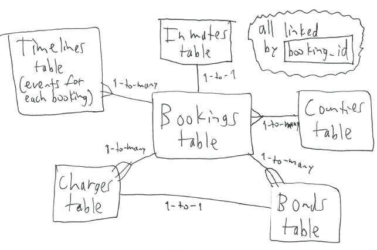

# Database Specification

## Philosophy
The fundamental entities are "bookings".
One person arrested for something = one booking = one row in **Bookings** table = one analysis datapoint. 
Across database, booking data is linked by unique `booking_id`. 
For example, a booking has a county, an inmate, one or more charges & bonds. 
Each booking also has a timeline; chronological entries in the **Timelines** table. These log all events that happen to the booking and # days jailed when it occurred. 

## "Minimal Database" table specification
The goal of the minimal table is to quickly create a plot to answer the question: "How long are people with misdemeanors in jail before they are released?"

Bookings table | Description
------------ | -------------
booking_id | Primary key
booking_id_string | Concatenated CSV fields to make unique identifiers for each booking, for searching if a booking already exists in database. For example, `inmate_lastname` + `inmate_address` + `booking_timestamp`. The concatenated fields are different for each county!
county_name | Same as CSV
booking_timestamp | Same as CSV
release_timestamp | Same as CSV - only for known releases, not if inmate just dropped off roster one day
known_misdemeanor | **`1`** if all charges' severity is `misdemeanor`. **`0`** if at least one charge's severity is unknown, i.e. blank in CSV. Note felonies are deliberately excluded from minimal database.

## "Full Database" table specification
All timestamps are in [Postgres timestamp format](https://www.postgresql.org/docs/9.1/static/datatype-datetime.html): `'2004-10-19 10:23:54 EST'`



Bookings table | Description
------------ | -------------
booking_id | Primary key
booking_timestamp | Same as CSV
release_timestamp | Same as CSV - only for known releases, not if inmate just dropped off roster one day
county_name | Foreign key to **Counties**
url | Same as CSV
processing_numbers | Same as CSV
facility | Same as CSV
other | Same as CSV
notes | Same as CSV

Inmates table\* | Description
------------ | -------------
booking_id | Primary key and foreign key to **Bookings**
inmate_id | Same as CSV - inmate ID number given by the county.
inmate_lastname | Same as CSV
inmate_firstname | Same as CSV
inmate_middlename | Same as CSV
inmate_sex | Same as CSV
inmate_race | Same as CSV
inmate_age | Same as CSV
inmate_dob | Same as CSV
inmate_address | Same as CSV

*\*A new inmate is added for each booking, so **Inmates & Bookings** have 1-to-1 relationship. If someone gets booked, released & re-booked the same person will be on multiple rows. 
Likewise if same person gets booked in multiple counties. Let's assume, statistically speaking, one person booked twice is like two people each booked once (with identical age/race/sex/etc.)*

Counties table | Description
------------ | -------------
county_name | Primary key
current_roster | TRUE if county posts current roster, else FALSE
release_info | TRUE if county posts any release information, else FALSE
stale_days* | After how many days should booking be marked as `Stale`, relative to the last day something changed in **Timelines**? At that point we think no new information will come for a while, perhaps never. Default=`NaN`
expire_days* | After how many days should booking be marked as `Expired`, relative to the last day something changed in **Timelines**? At that point we are 100% sure no new information will come. Default=`NaN`. [Expiration criteria for each county](https://github.com/lahoffm/aclu-bail-reform/blob/master/docs/County-jail-summaries.xlsx)
stale_events* | Which event(s) signify booking should be marked as `Stale`? Default=`NaN`
expire_events* | Which event(s) signify booking should be marked as `Expired`? Like `'Released \| Dropped Off Roster'` if there's 2 such events. Default=`NaN`. [Expiration criteria for each county](https://github.com/lahoffm/aclu-bail-reform/blob/master/docs/County-jail-summaries.xlsx)

*\*Either `stale_days` or `stale_events` should be set, the other should be `NaN`.*  
*\*Either `expire_days` or `expire_events` should be set, the other should be `NaN`.

Charges table\* | Description
------------ | -------------
booking_id |  Composite primary key with `charge_number` and foreign key to **Bookings**
charge_number | Composite primary key with `booking_id`. 1, 2, 3 for charge 1, 2, 3 within a given booking
agency | Same as CSV
charges | Same as CSV
severity | Same as CSV
current_status | Same as CSV
court_dates | Same as CSV

*\*Each charge gets its own row, no more ' | '*

Bonds table\* | Description
------------ | -------------
booking_id | Composite primary key with `bond_number` and foreign key to **Bookings**
charge_number | If there's one bond across all charges, it's `NaN`. If there's one bond for each charge, it matches the `charge_number` with the same `booking_id` in **Charges**.
bond_amount | Bond amount in dollars
bond_text | Any bond-related text

*\*Each bond gets its own row, no more ' | '*

Timelines table | Description
------------ | -------------
booking_id | Composite primary key with `timestamp` and foreign key to **Bookings**
timestamp | Composite primary key with `booking_id`; date/time each event happened. Whenever possible, use the jail's timestamps instead of time data was scraped.
event | [Event name](#event-type). Anything that happened since the last event, including `No Change` and/or `On Roster` if we did a scrape but the booking info didn't change. **Multiple events can happen for a single scrape!**
notes | More info about event, like `'Replaced old row A \| B \| C with new row X \| Y \| Z' in Bookings table`
days_jailed | Days inmate has been sitting in jail as of `timestamp`. Rounded up to nearest day, so 25 hours = 2 days. Set to `NaN` whenever we can't positively confirm that they have indeed been jailed that many days. Also set to `NaN` for events occurring after person was released or dropped off roster.
total_days_jailed | Total days jailed from booking to release. Only set this for `event = 'Released'`, otherwise `NaN`.

<a name="event-type"></a>

Event names allowed in Timelines table | Description
------------------------------- | -----------------------
Booked | First event for all bookings. Set its `timestamp` equal to the CSV's `booking_timestamp`. This event is only to mark the time of booking! If someone was booked, released 2 hours later, and all this data was scraped into one CSV file, you should also make a `Released` event.
Released | Inmate was released. Don't set this when inmate merely dropped off a roster, we don't know they left the roster because they were released!
Dropped Off Roster | Inmate dropped off roster. Only set this when county posts full inmate roster but no release information.
Post-trial | Clear indicator that inmate is no longer pre-trial. One example is when it says sentenced for at least one charge.
{fieldname} Changed | Another field changed in the CSV file. For example if `bond_amount` went from `'$1000.00 bond set'` to `'$1000.00 bond posted'` the event name is `'bond_amount Changed'`. If a second field changed, like `current_status` from `'Pre-trial'` to `'Sentenced'`, make a second event `'current_status Changed'`.
On Roster | Inmate was listed on roster at the time data was scraped. Only set this when county lists full inmate rosters. Otherwise we can't be sure, even if there's no release date. Maybe they were transferred.  **Note: this event is always connected to a particular `booking_id`.** Don't say `On Roster` for one `booking_id` if same inmate is later arrested under a different `booking_id`. *Don't set this when the most recent event was `Stale` or `Expired`.*
No Change | Nothing changed since the most recent event. When county lists full inmate rosters, set both `On Roster` and `No Change`. Otherwise just set `No Change`. *Don't set this when the most recent event was `Stale` or `Expired`.*
Stale | Booking is stale, based on `stale_days` or `stale_events` in **Counties**. Set this event when there has been nothing but `No Change` or `On Roster` for `stale_days` days. Also set this event when the most recent event matches one of the `stale_events`.  if an event used to be stale but something changed, there will be a new event that is more recent than `Stale`, effectively restarting the stale checking.
Expired | Booking is expired, based on `expired_days` or `expired_events` in **Counties**. Set this event when there has been nothing but `No Change`, `On Roster` or `Stale` for `expired_days` days. Also set this event when any event matches one of the `expired_events`. **Never set any event after `Expired`!**

## Why make a timeline instead of just a `release_date` field?
We want to know how long people are jailed pre-trial, but [each county posts different information](https://github.com/lahoffm/aclu-bail-reform/blob/master/docs/County-jail-summaries.xlsx) about inmate releases. Some post nothing. 
Some only have current roster, so we have to see when they dropped off roster (but they could have been transferred or sentenced). 
Some only post bookings for the last 3 days, and whether those people were released. This means we have no idea what happened to someone that was not released as of day 3. And so on.

It's cleaner to make a timeline of everything that happens to each booking and let the API/visualization extract meaningful info *keeping in mind the county's peculiarities*. 
For example, it could use the `'Released'` event to get `total_days_jailed` for all inmates that were released in a given month, 
or the `'On Roster'` event to get `days_jailed` for all inmates on the roster on a particular day. 

There are more advantages to using a timeline. We will know what happened every single time we scraped, even if nothing changed, like "still on roster day 10, still on roster day 11, ...". 
We can log when other information changes, like a charge's `current_status`. Finally, we can log when a booking gets stale or expired, indicating it is unlikely we will get new information.

## How to ensure chronological integrity
We want to initialize a booking when we first scrape info about it, and update every time a subsequent scrape reveals new info. 
When constructing and updating database **always go from earliest to most recent scraped CSV** according to timestamp in CSV filename. 
This will work even if we query past data, like getting Nov 2017 bookings in Jan 2018. If those bookings are already in database (via daily scrapes we did in Nov 2017) the new data is just updated info.
If we never scraped Nov 2017, the new data is just a set of new bookings to initialize. Same thing if we re-query Nov 2017 in Feb 2018.

## Algorithm to get info in database
```
For each CSV file, starting with earliest and going to most recent
	If any bookings dropped off roster (not all counties have this), add event to Timelines table - possibly updating stale/expired.
	
	For each row in CSV file
		Find the corresponding booking in Bookings table (for each county, pick fields to compare that are guaranteed not to change)
		If no match, it's a new booking.
			Fill all tables with the new info including 'Booked' in Timelines table.
			Check whether you have to make additional events besides 'Booked', like 'Released'.
		If match, it's an existing booking.
			If anything changed (compare each CSV field to corresponding database entries)
				If the most recent event is 'Stale'
					It's no longer stale. Proceed.
				If the most recent event is 'Expired'
					Error.
				Make appropriate events in Timelines table. There could be multiple events at the same time, like 'bond_amount Changed', 'current_status Changed' and 'Released'.
				Change whatever other tables have to be edited, keeping the most recent thing. For example, if they change the bond info just replace
				those entries in Bonds and make a Timelines event called 'bond_amount Changed'.

			If nothing changed and the most recent event isn't 'Stale' or 'Expired'
				Make a 'No Change'/'On Roster' event in Timelines table, depending on the data
				(e.g. if county gives booking data but no complete roster list you can't say 'On Roster').

	Check if any bookings got stale/expired, add event to Timelines table
	--> This is county-specific logic; compare 'No change' timelines and the most recent event to flags in Counties table
	--> Check for Expired & add that event first since it's more informative than 'Stale'.
```